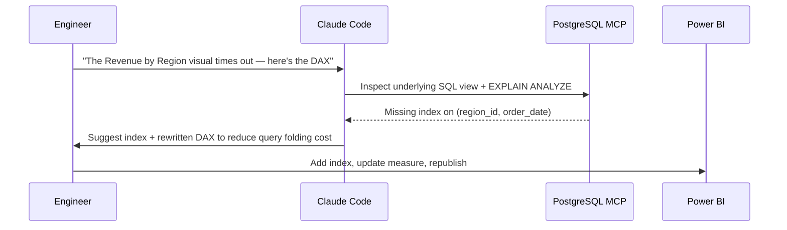

# Examples

End-to-end worked examples that tie multiple parts of the toolkit together.

## Overview

Individual sections document one tool or technique at a time. This section shows a few of them combined into a realistic workflow.

## Problem

It's not always obvious how a Claude Code skill, an MCP server, and a BI tool fit together in practice — documentation organized by tool alone can leave that connective step implicit.

## Solution

Walk through one complete example: using the [SQL Assistant Skill](../claude-code/sql-assistant-skill.md) together with the [PostgreSQL MCP](../mcp/postgresql-mcp.md) server to diagnose a slow-running report query, then feeding the fix into a [Power BI](../powerbi/dax.md) measure.

## Example

**Scenario:** A Power BI report's "Revenue by Region" visual is timing out against a DirectQuery source.



## Code snippets

Index identified as missing:

```sql
CREATE INDEX CONCURRENTLY idx_orders_region_date
    ON orders (region_id, order_date);
```

DAX measure simplified to fold more efficiently against the DirectQuery source:

```dax
Revenue by Region =
CALCULATE (
    SUM ( orders[revenue] ),
    USERELATIONSHIP ( orders[region_id], regions[region_id] )
)
```

## Notes

- DirectQuery performance issues are very often a missing-index problem at the source, not a DAX problem — check both.
- `CREATE INDEX CONCURRENTLY` avoids locking the table during creation, important for a live production database.
- This kind of cross-tool workflow is where AI assistance pays off most: the human already knows *what's* wrong; the assistant accelerates finding *why*.

## References

- [SQL Assistant Skill](../claude-code/sql-assistant-skill.md)
- [PostgreSQL MCP](../mcp/postgresql-mcp.md)
- [Power BI: DAX](../powerbi/dax.md)
