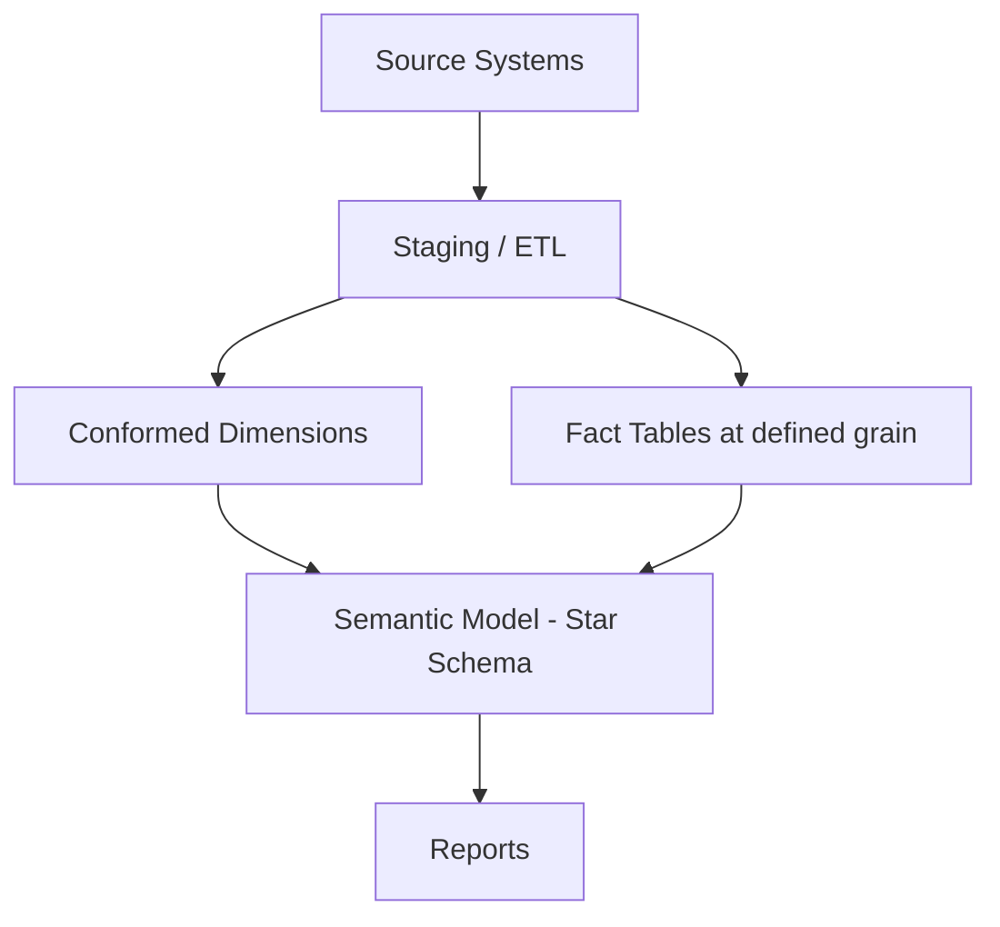

# Data Modelling

## Overview

Decisions about grain, star vs. snowflake schema, and how to handle many-to-many relationships determine most of a Power BI model's long-term performance and maintainability.

## Problem

Modelling decisions made early — importing a normalized OLTP schema as-is, or picking the wrong fact-table grain — are expensive to unwind once reports and measures depend on them.

## Solution

Default to a star schema at the lowest grain the business actually reports on, use bridge tables for genuine many-to-many relationships, and resolve role-playing dimensions (e.g. order date vs. ship date) with separate dimension tables rather than bidirectional relationships.



## Example

A many-to-many relationship between `FactSales` and a `Promotions` dimension (one sale can have multiple promotions applied) resolved via a `BridgeSalesPromotions` table rather than a direct bidirectional relationship.

## Code snippets

```tmdl
table BridgeSalesPromotions
    column SalesKey
    column PromotionKey

relationship 'Bridge-Sales'
    fromColumn: BridgeSalesPromotions.SalesKey
    toColumn: FactSales.SalesKey

relationship 'Bridge-Promotions'
    fromColumn: BridgeSalesPromotions.PromotionKey
    toColumn: DimPromotions.PromotionKey
```

## Notes

- Snowflaking (splitting a dimension into normalized sub-tables) rarely pays off in Power BI — prefer flattened, denormalized dimensions.
- Role-playing dimensions: create separate physical or virtual date tables (`DimOrderDate`, `DimShipDate`) rather than multiple relationships to one date table.
- Document the grain of every fact table explicitly — it's the single most useful sentence for onboarding a new modeller.

## References

- [Microsoft Learn: Relationship guidance](https://learn.microsoft.com/power-bi/guidance/relationships-treat-dimension-tables)
- [Kimball Group: Dimensional modelling techniques](https://www.kimballgroup.com/data-warehouse-business-intelligence-resources/kimball-techniques/dimensional-modeling-techniques/)
