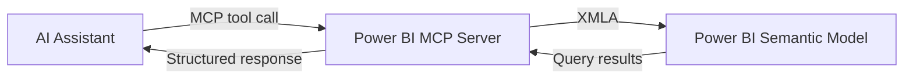

# MCP Integration

## Overview

Connecting Power BI to an AI assistant via MCP (see [Power BI MCP](../mcp/powerbi-mcp.md)) turns semantic model exploration and DAX querying into a conversational workflow, without leaving the assistant's chat interface.

## Problem

Answering "what does this model contain" or "what would this DAX return" normally requires opening Power BI Desktop or Tabular Editor, which is slow for quick checks and breaks flow when working primarily in an AI assistant or code editor.

## Solution

Register a Power BI MCP server against the workspace's XMLA endpoint. This exposes tools for listing tables/measures/relationships and executing DAX queries, so the assistant can inspect and query the model directly.



## Example

**Prompt:** "List every measure in the model that references the `FactSales` table, and run `Total Revenue` split by `Region`."

**Result:** The assistant lists matching measures via the metadata tool, then executes an `EVALUATE SUMMARIZECOLUMNS(...)` query and renders a table.

## Code snippets

Example DAX query executed through the MCP tool:

```dax
EVALUATE
SUMMARIZECOLUMNS (
    DimCustomer[Region],
    "Total Revenue", [Total Revenue]
)
```

## Notes

- XMLA read/write endpoints require Power BI Premium or Fabric capacity — Pro workspaces only support read-only XMLA.
- Use a service principal with least-privilege workspace access for automated/AI-driven connections.
- Treat AI-suggested model changes as proposals — review generated TMDL before publishing.

## References

- [Power BI MCP](../mcp/powerbi-mcp.md)
- [Microsoft Learn: XMLA endpoint connectivity](https://learn.microsoft.com/power-bi/enterprise/service-premium-connect-tools)
