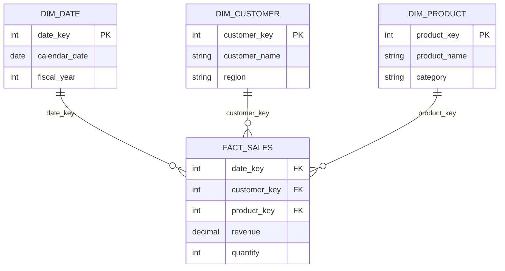

# Semantic Models

## Overview

A Power BI semantic model (formerly "dataset") is the layer between raw data sources and reports: tables, relationships, measures, and metadata that define what business users can query. Getting this layer right determines whether reports are fast, trustworthy, and easy to extend.

## Problem

Semantic models built directly from source-system tables tend to accumulate ambiguous relationships, inconsistent grain, and measures scattered across the wrong tables — making reports slow and hard to maintain.

## Solution

Design the semantic model as a deliberate star schema: one fact table per business process at a consistent grain, surrounded by conformed dimension tables, with all measures centralized in a dedicated measures table (or clearly organized display folders).



## Example

A retail sales model with `FactSales` at line-item grain, joined to `DimDate`, `DimCustomer`, and `DimProduct`, each with single-direction, one-to-many relationships flowing into the fact table.

## Code snippets

TMDL definition of a fact table relationship:

```tmdl
relationship 'FactSales-DimDate'
    fromColumn: FactSales.DateKey
    toColumn: DimDate.DateKey
    crossFilteringBehavior: singleDirection
```

A simple, centralized measure defined in a dedicated `_Measures` table:

```dax
Total Revenue =
SUM ( FactSales[Revenue] )
```

## Notes

- Keep fact tables narrow — remove columns not used for filtering or aggregation.
- Avoid bidirectional relationships unless there's a specific, understood reason.
- Mark date tables as official date tables (`Mark as Date Table`) to get correct time-intelligence behaviour.

## References

- [Microsoft Learn: Understand star schema](https://learn.microsoft.com/power-bi/guidance/star-schema)
- [TMDL format documentation](https://learn.microsoft.com/analysis-services/tmdl/tmdl-overview)
